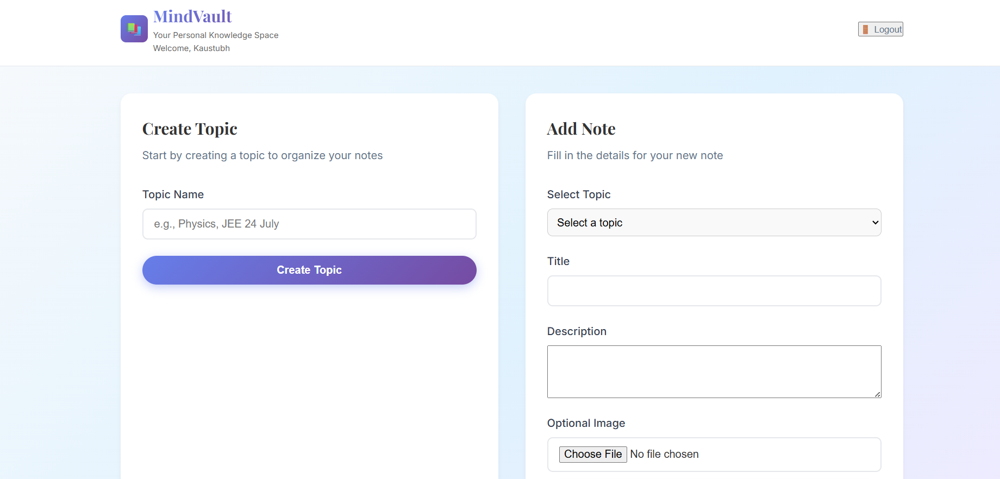
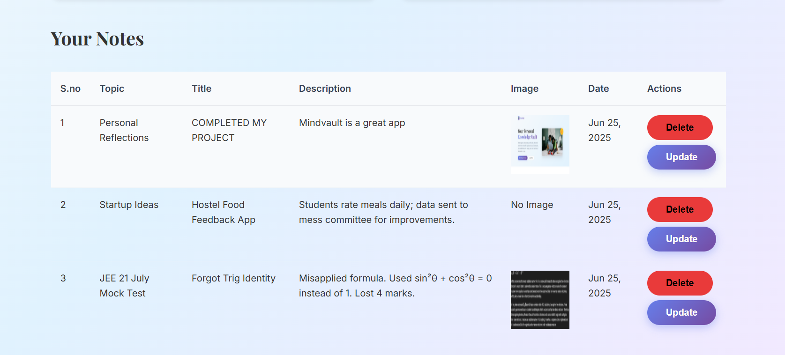
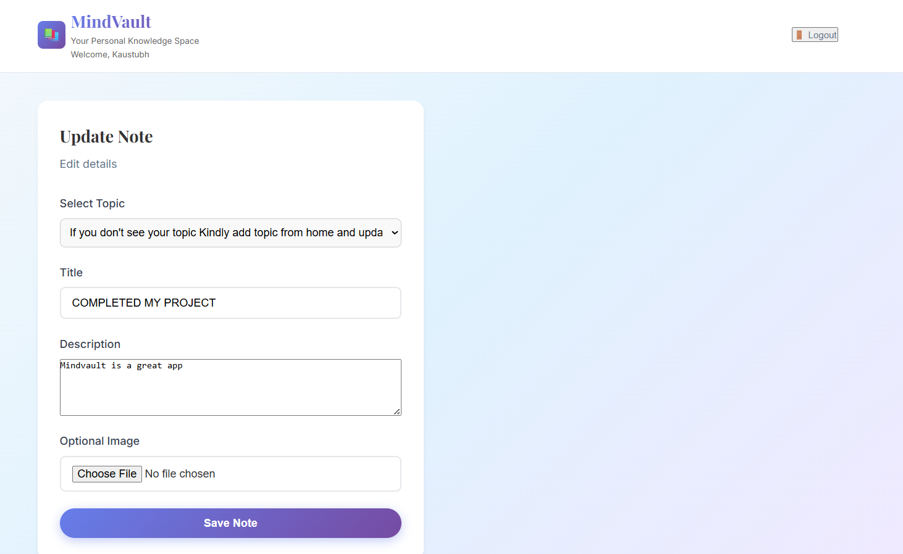

# 📚 MindVault

MindVault is a personal knowledge vault web application built with **Django**. It helps you store, organize, and manage your notes or mistakes categorized by topics — especially helpful for exam prep like JEE, NEET, etc.

---

## 🔍 Features

### ✅ Authentication
- Secure **login** and **registration** system using Django’s `User` model.
- Separate login and register forms (no JavaScript logic handling logic, all done server-side).
- Logout functionality with CSRF protection.

### 🗂️ Topic Management
- Users can **create topics** to organize notes.
- Topics are **user-specific** — no mixing between users.
- Clean topic selection in a dropdown form with a placeholder.

### 📝 Note Entry
- Add notes under a selected topic with:
  - Title
  - Description
  - Optional image upload (e.g., screenshot of a mistake or question)
- Notes are time-stamped and associated with the current user and topic.
- Topic names are shown alongside each entry.

### 📋 View Notes
- Notes are shown in a responsive table layout.
- Fields shown:
  - Serial number
  - Topic
  - Title
  - Description
  - Image preview (if available)
  - Date
- Only your own notes are visible after login.

### ✏️ Update / Delete Notes
- Update existing notes from a form pre-filled with their current data.
- Change title, description, topic, or image.
- Secure delete functionality only if the note belongs to the current user.

---

## 🖼️ Screenshots

### 🔐 Home Page


### 📝 Add Note Interface


### 📑 Notes Table View


### ✏️ Update Entry



## 🛠️ Setup Instructions

1. **Clone the repo**
   ```bash
   git clone https://github.com/your-username/mindvault.git
   cd mindvault


2. **python -m venv env**
    source env/bin/activate  # Windows: env\Scripts\activate

3. **pip install -r requirements.txt**

4. **python manage.py makemigrations**

5. **python manage.py migrate**

## Run Server

**python manage.py runserver**


MindVault/<br>
│<br>
├── Notes/<br>
│   ├── templates/<br>
│   │   ├── login.html<br>
│   │   ├── register.html<br>
│   │   ├── home.html<br>
│   │   └── update_entry.html<br>
│   ├── models.py<br>
│   ├── views.py<br>
│   └── ...<br>
│<br>
├── static/<br>
│   └── css/<br>
│       └── styles.css<br>
│<br>
├── media/<br>
│   └── entries/<br>
│<br>
├── db.sqlite3<br>
└── manage.py<br>


## Features

🔐 User authentication (login & register)

📝 Create topics to group your notes

📚 Add entries with title, description, optional image

🛠️ Edit and delete only your own entries

🎨 Clean and responsive UI with no JavaScript for logic

📁 All notes categorized by topic with image preview

